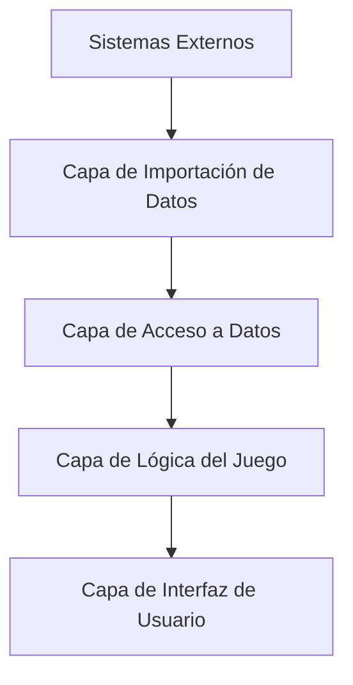

# Proyecto 3EnRaya_Futbol

## Propósito y Alcance

Este documento ofrece una introducción de alto nivel al proyecto **3EnRaya_Futbol**, un juego de tres en raya con temática de fútbol que se integra con MongoDB para validar el conocimiento de los jugadores.  
El sistema combina la jugabilidad tradicional del tres en raya con trivia de fútbol, requiriendo que los jugadores nombren futbolistas reales que coincidan con combinaciones de categorías específicas para reclamar posiciones en el tablero.

- Para información detallada sobre la aplicación principal del juego, consulta la sección **Aplicación del Juego**.
- Para detalles específicos sobre la gestión de la base de datos, consulta **Sistema de Gestión de Datos**.
- Para instrucciones de configuración del proyecto, consulta **Configuración e Instalación del Proyecto**.

---

## Concepto del Juego

A diferencia del tres en raya tradicional donde los jugadores simplemente colocan X's y O's, este juego requiere que los jugadores demuestren su conocimiento de fútbol.

Cada posición del tablero representa la intersección de dos categorías (por ejemplo, un equipo y una posición), y los jugadores deben introducir el nombre de un futbolista real que coincida con ambas categorías para reclamar esa casilla.

---

## Mecánicas de Juego Principales

El juego genera una cuadrícula de 3x3 donde:

- **Categorías Horizontales**: Equipos, países, posiciones, números de camiseta o rangos de edad.
- **Categorías Verticales**: Diferentes a las horizontales para crear intersecciones significativas.
- **Validación del Jugador**: Cada movimiento se valida contra una base de datos MongoDB con más de 276 registros de jugadores reales.
- **Condiciones de Victoria**: Reglas tradicionales del tres en raya + detección de "juego atascado" si no quedan movimientos válidos.

---

## Arquitectura del Sistema



---

## Componentes Clave

### `FutbolEnRaya` (Interfaz gráfica y lógica del juego)

- **Ventana Principal**: `JFrame`
- **UI**: `JButton[3][3]`, `JTextField nombreJugadorField`, `JLabel[] categoriaLabels`
- **Estado del Juego**: `String[][] tablero`, `String turnoActual`, `Set jugadoresUtilizadosEnPartida`
- **Selección de Categorías**: `seleccionarCategoriasParaTableroJugable()`, `List[][] jugadoresDisponiblesPorCasilla`
- **Validación de Movimientos**: `manejarClick(int fila, int columna)`, `quedanOpcionesParaJugadorActual()`

### `TicTacToeDB` (Base de datos)

- **Gestión de Jugadores**: `precargarJugadores()`, `getPlayersByCategories()`

### `Jugador` (Modelo de datos)

- Atributos: `String nombre`, `List clubs`

### `JsonManipulator`

- Importación desde base de datos local (`players.json`)

### `MongoDBImporter`

- Importación desde base de datos en la nube (MongoDB Atlas)

---

## Flujo del Juego y Validación de Movimientos

Flujo del Juego y Validación de Movimientos
Inicialización del Juego
precargarJugadores(): Se encarga de precargar todos los jugadores disponibles.

Carga en memoria: Los datos de jugadores se cargan en memoria desde la base de datos.

Obtención desde MongoDB: Los datos se recuperan de la colección futbol_en_raya.jugadores.

seleccionarCategoriasParaTableroJugable(): Se eligen aleatoriamente categorías horizontales y verticales válidas para el tablero.

Inicialización de la matriz jugadoresDisponiblesPorCasilla[3][3]: Se rellena con jugadores válidos para cada casilla del tablero según las combinaciones de categorías.

Intento de Movimiento del Jugador
El jugador hace clic en una celda y escribe el nombre de un futbolista.

Se verifica si ese jugador ya fue usado:

Si ya fue usado: Se muestra un mensaje de error y no se cambia el turno.

Si no fue usado:

Se consultan los jugadores válidos para esa celda.

Se valida el nombre introducido:

Si es válido:

Se marca la celda.

Se añade el jugador a la lista de usados.

Se evalúa si hay un ganador o empate:

Si hay ganador o tablero lleno: Se muestra el mensaje final.

Si no: Se cambia el turno.

Si es inválido:

El jugador es penalizado.

Se cambia el turno y se muestra un mensaje de error.

Se verifica si el jugador actual aún tiene opciones válidas en el tablero:

Si no las tiene: Se indica que el juego está atascado.

Si las tiene: El juego continúa normalmente
---

## Sistema de Categorías y Generación del Tablero

El juego utiliza un algoritmo para asegurar que cada celda tenga al menos un jugador válido.

### Tipos de Categorías

- **Horizontales**: `PAIS`, `CLUB`
- **Verticales**: `POSICION`, `DORSAL`, `PAIS`, `EDAD_RANGO`

### Algoritmo de Selección de Categorías
Este algoritmo asegura que todas las celdas del tablero (3x3) tengan al menos un jugador válido disponible según las categorías seleccionadas:

Función seleccionarCategoriasParaTableroJugable():

Realiza un máximo de 1000 intentos para generar un tablero válido.

Selección de tipos de categorías:

Se generan pares de tipos de categoría (una para filas, otra para columnas).

Se evita que ambos tipos sean iguales.

Selección de valores concretos:

Se eligen los 3 valores más frecuentes para cada tipo usando getMostFrequentValues().

Población de celdas:

Para cada celda del tablero, se combinan las categorías horizontal y vertical correspondientes.

Se utiliza getPlayersByCategories() para obtener los jugadores válidos que coinciden con esa combinación.

Se guarda la lista de jugadores válidos para cada celda.

Validación del tablero:

Solo se considera un tablero válido si las 9 celdas tienen al menos un jugador posible.

---

## Pila Tecnológica y Dependencias

| Componente           | Tecnología              | Versión     | Propósito                                  |
|----------------------|-------------------------|-------------|---------------------------------------------|
| Plataforma           | Java SE                 | 21          | Plataforma principal                        |
| UI Framework         | Swing                   | N/A         | Interfaz gráfica                            |
| Base de Datos        | MongoDB                 | 5.4.0       | Almacenamiento de jugadores                 |
| Driver MongoDB       | MongoDB Sync Driver     | 5.4.0       | Operaciones síncronas de base de datos      |
| Formato de Datos     | JSON                    | 20240303    | Importación/exportación de datos            |
| Documentos Binarios  | BSON                    | 5.4.0       | Formato interno de MongoDB                  |

### Librerías JAR

- `bson-5.4.0.jar`
- `mongodb-driver-core-5.4.0.jar`
- `mongodb-driver-sync-5.4.0.jar`
- `json-20240303.jar`

---

## Arquitectura de Datos

Flujo de datos desde la fuente hasta la aplicación:
Fuente de Datos Externa: La información proviene principalmente de transfermarkt.es (de forma manual).

Extracción y Conversión:

Se recopilan datos de jugadores de la Liga Española.

Los datos se almacenan localmente en un archivo llamado players.json, con más de 276 registros.

Importación de Datos:

Se puede importar el archivo JSON usando dos componentes:

JsonManipulator: Para bases de datos locales.

MongoDBImporter: Para subir datos a una instancia en la nube (MongoDB Atlas).

Carga en la Base de Datos:

Los datos se almacenan en la colección futbol_en_raya.jugadores usando un esquema basado en documentos BSON.

Carga en Caché de Aplicación:

Al iniciar, se ejecuta precargarJugadores() para cargar todos los datos en memoria.

Se guarda en la caché del componente TicTacToeDB para evitar múltiples consultas a la base de datos.

Listas de Categorías Distintas:

Durante la precarga, se generan listas con los posibles valores únicos de:

Clubs

Nacionalidades

Posiciones

Dorsales

### Estructura del archivo `players.json`

```json
{
  "nombre": "String",
  "nacionalidad": "String",
  "clubs": ["List<String>"],
  "posicion": "String",
  "numero_camiseta": "String",
  "edad": Integer
}
```

---

## Puntos de Entrada y Clases Principales

| Clase            | Propósito                                | Métodos Clave                                      |
|------------------|-------------------------------------------|----------------------------------------------------|
| `FutbolEnRaya`   | Aplicación principal y UI                 | `main()`, `manejarClick()`, `iniciarNuevaPartida()`|
| `TicTacToeDB`    | Conexión y consultas a MongoDB            | `precargarJugadores()`, `getPlayersByCategories()` |
| `JsonManipulator`| Importación de base de datos local        | Importación desde `players.json`                   |
| `MongoDBImporter`| Importación desde MongoDB Atlas           | JSON a MongoDB en la nube                          |

---

## Inicio de la Aplicación

La aplicación se inicia desde:

```java
FutbolEnRaya.main()
```

Esto inicializa la conexión con la base de datos y lanza la interfaz gráfica Swing en el Event Dispatch Thread.
