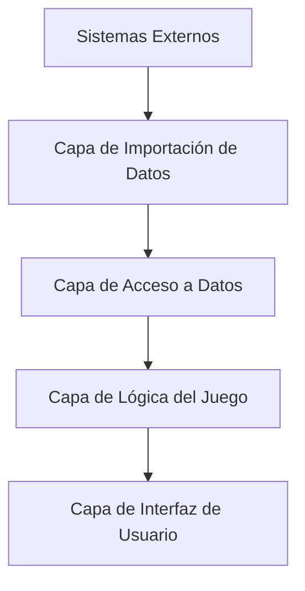

# Proyecto 3EnRaya_Futbol

## Propósito y Alcance

Este documento ofrece una introducción de alto nivel al proyecto **3EnRaya_Futbol**, un juego de tres en raya con temática de fútbol que se integra con MongoDB para validar el conocimiento de los jugadores.  
El sistema combina la jugabilidad tradicional del tres en raya con trivia de fútbol, requiriendo que los jugadores nombren futbolistas reales que coincidan con combinaciones de categorías específicas para reclamar posiciones en el tablero.

- Para información detallada sobre la aplicación principal del juego, consulta la sección **Aplicación del Juego**.
- Para detalles específicos sobre la gestión de la base de datos, consulta **Sistema de Gestión de Datos**.
- Para instrucciones de configuración del proyecto, consulta **Configuración e Instalación del Proyecto**.

---

## Concepto del Juego

A diferencia del tres en raya tradicional donde los jugadores simplemente colocan X's y O's, este juego requiere que los jugadores demuestren su conocimiento de fútbol.

Cada posición del tablero representa la intersección de dos categorías (por ejemplo, un equipo y una posición), y los jugadores deben introducir el nombre de un futbolista real que coincida con ambas categorías para reclamar esa casilla.

---

## Mecánicas de Juego Principales

El juego genera una cuadrícula de 3x3 donde:

- **Categorías Horizontales**: Equipos, países, posiciones, números de camiseta o rangos de edad.
- **Categorías Verticales**: Diferentes a las horizontales para crear intersecciones significativas.
- **Validación del Jugador**: Cada movimiento se valida contra una base de datos MongoDB con más de 276 registros de jugadores reales.
- **Condiciones de Victoria**: Reglas tradicionales del tres en raya + detección de "juego atascado" si no quedan movimientos válidos.

---

## Arquitectura del Sistema



---

## Componentes Clave

### `FutbolEnRaya` (Interfaz gráfica y lógica del juego)

- **Ventana Principal**: `JFrame`
- **UI**: `JButton[3][3]`, `JTextField nombreJugadorField`, `JLabel[] categoriaLabels`
- **Estado del Juego**: `String[][] tablero`, `String turnoActual`, `Set jugadoresUtilizadosEnPartida`
- **Selección de Categorías**: `seleccionarCategoriasParaTableroJugable()`, `List[][] jugadoresDisponiblesPorCasilla`
- **Validación de Movimientos**: `manejarClick(int fila, int columna)`, `quedanOpcionesParaJugadorActual()`

### `TicTacToeDB` (Base de datos)

- **Gestión de Jugadores**: `precargarJugadores()`, `getPlayersByCategories()`

### `Jugador` (Modelo de datos)

- Atributos: `String nombre`, `List clubs`

### `JsonManipulator`

- Importación desde base de datos local (`players.json`)

### `MongoDBImporter`

- Importación desde base de datos en la nube (MongoDB Atlas)

---

## Flujo del Juego y Validación de Movimientos

```mermaid
Inicialización del Juego
    A[precargarJugadores ( )] --> B[Cargar todos los jugadores en memoria]
    B --> C[Datos de la colección de jugadores]
    C --> D[seleccionarCategoriasParaTableroJugable()]
    D --> E[Inicializar jugadoresDisponiblesPorCasilla[3][3]]
  end

Intento de Movimiento del Jugador
    F[Click en celda + nombre del jugador] --> G{¿Jugador ya usado?}
    G -- Sí --> H[Error, sin cambio de turno]
    G -- No --> I[Obtener jugadores válidos para celda]
    I --> J[Lista de jugadores válidos]

    J -- Válido --> K[Marcar celda, añadir a usados]
    K --> L[hayGanador() o tableroLleno()]
    L -- No --> M[Cambiar turno]
    L -- Sí --> N[Mostrar ganador]
    M --> O[Actualizar UI]

    J -- Inválido --> P[Penalización, cambiar turno]
    P --> Q[Mostrar error]

    K --> R[quedanOpcionesParaJugadorActual()]
    R -- No --> S[Mostrar "juego atascado"]
    R -- Sí --> T[Continuar juego]
  end
```

---

## Sistema de Categorías y Generación del Tablero

El juego utiliza un algoritmo para asegurar que cada celda tenga al menos un jugador válido.

### Tipos de Categorías

- **Horizontales**: `PAIS`, `CLUB`
- **Verticales**: `POSICION`, `DORSAL`, `PAIS`, `EDAD_RANGO`

### Algoritmo de Selección

```mermaid

  A[seleccionarCategoriasParaTableroJugable ( )] --> B[Máximo 1000 intentos]
  B --> C[Pares de Tipos de Categoría]
  C --> D{Evitar duplicados}
  D --> E[Seleccionar 3 valores por tipo]
  E --> F[getMostFrequentValues()]
  F --> G[Para cada celda]
  G --> H[getPlayersByCategories()]
  H --> I[Combinar vertical + horizontal]
  I --> J[Guardar jugadores válidos en celda]
  J --> K[Validar que todas las celdas tienen al menos 1 jugador]
```

---

## Pila Tecnológica y Dependencias

| Componente           | Tecnología              | Versión     | Propósito                                  |
|----------------------|-------------------------|-------------|---------------------------------------------|
| Plataforma           | Java SE                 | 21          | Plataforma principal                        |
| UI Framework         | JFrame                  | N/A         | Interfaz gráfica                            |
| Base de Datos        | MongoDB                 | 5.4.0       | Almacenamiento de jugadores                 |
| Driver MongoDB       | MongoDB Sync Driver     | 5.4.0       | Operaciones síncronas de base de datos      |
| Formato de Datos     | JSON                    | 20240303    | Importación/exportación de datos            |
| Documentos Binarios  | BSON                    | 5.4.0       | Formato interno de MongoDB                  |

### Librerías JAR

- `bson-5.4.0.jar`
- `mongodb-driver-core-5.4.0.jar`
- `mongodb-driver-sync-5.4.0.jar`
- `json-20240303.jar`

---

## Arquitectura de Datos

```mermaid
  A[Fuente de Datos Externa] --> B[Extracción manual de datos]
  B --> C[Transfermarkt.es]
  C --> D[Jugadores de la Liga Española]
  D --> E[players.json]
  E --> F[276+ Registros]
  F --> G[JsonManipulator]
  F --> H[MongoDBImporter]
  G --> I[precargarJugadores()]
  H --> J[MongoDB Collection]
  J --> K[futbol_en_raya.jugadores]
  K --> L[Almacenamiento basado en documentos]
  I --> M[Caché de la Aplicación]
  M --> N[Caché de TicTacToeDB]
  N --> O[List clubsPosibles]
  N --> P[List nacionalidadesPosibles]
  N --> Q[List posicionesPosibles]
  N --> R[List dorsalesPosibles]
```

### Estructura del archivo `players.json`

```json
{
  "nombre": "String",
  "nacionalidad": "String",
  "clubs": ["List<String>"],
  "posicion": "String",
  "numero_camiseta": "String",
  "edad": Integer
}
```

---

## Puntos de Entrada y Clases Principales

| Clase            | Propósito                                | Métodos Clave                                      |
|------------------|-------------------------------------------|----------------------------------------------------|
| `FutbolEnRaya`   | Aplicación principal y UI                 | `main()`, `manejarClick()`, `iniciarNuevaPartida()`|
| `TicTacToeDB`    | Conexión y consultas a MongoDB            | `precargarJugadores()`, `getPlayersByCategories()` |
| `JsonManipulator`| Importación de base de datos local        | Importación desde `players.json`                   |
| `MongoDBImporter`| Importación desde MongoDB Atlas           | JSON a MongoDB en la nube                          |

---

## Inicio de la Aplicación

La aplicación se inicia desde:

```java
FutbolEnRaya.main()
```

Esto inicializa la conexión con la base de datos y lanza la interfaz gráfica Swing en el Event Dispatch Thread.
